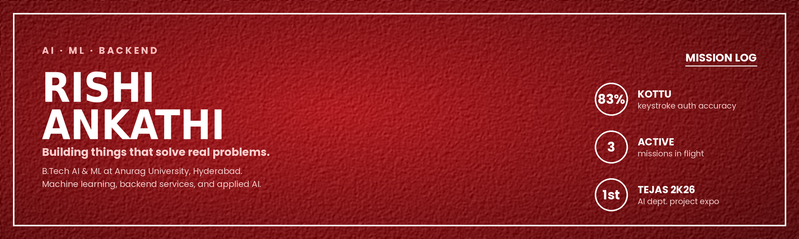
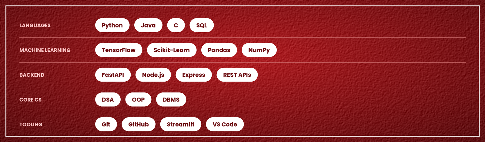

  

  
  
  
  

## 🕸️ Origin Story

B.Tech in AI &amp; ML at **Anurag University**, Hyderabad *(2023 – 2027)*.

I build practical software systems — mostly around machine learning, backend services, and applied AI. Some projects start as coursework, some as portfolio ideas, others from problems I run into. However they start, I like taking an idea and seeing how far it goes.

If you spot a better approach or want to share an idea, my inbox is open.

---

## 💥 Active Missions

<table width="100%">
<tr>
<td width="33%" valign="top" align="center">
<h3>🔦 OSSNavigator</h3>

</td>
<td width="33%" valign="top" align="center">
<h3>🧬 <a href="https://github.com/Rishi-Ankathi/KOTTU">KOTTU</a></h3>

</td>
<td width="33%" valign="top" align="center">
<h3>☄️ <a href="https://github.com/karthikguntoju/spaceverse">Spaceverse</a></h3>

</td>
</tr>
<tr>
<td valign="top">

Platform that helps developers explore open-source repos and find contribution opportunities they can actually take on.

Backend services pull and analyze repository structure and activity from GitHub, so contributors can understand a project before diving in.

`FastAPI` `Python` `REST API`

</td>
<td valign="top">

Behavioral authentication that tells 51 users apart from their typing rhythm alone — no password required.

Stacked LSTM over keystroke timings, **83.21% test accuracy**. Written up in detail below.

`TensorFlow` `Scikit-Learn` `Streamlit`

</td>
<td valign="top">

Interactive 3D solar system simulator built to make space education engaging for younger learners.

I worked on the AI chatbot that answers space and astronomy questions, plus deployment and platform improvements.

🏆 1st Prize — TEJAS 2K26 Expo 
🐝 Selected for HIVE incubation

`Three.js` `React` `Node.js`

</td>
</tr>
</table>

<i>Three missions active. The rest are in the archives.</i>

<b>🧪 From the Archives</b>

 

- **Airline Passenger Forecaster** — time-series forecasting with an interactive Streamlit dashboard
- **Telecom Churn Prediction** — classification on customer retention data
- **BeaconAI** — government scheme recommendation platform
- Machine learning algorithms, data analysis &amp; visualization
- College coursework, hackathon builds, and small prototypes

---

### 🧬 Closer look — KOTTU

Most systems check *what you know* — a password. KOTTU checks *how you type* it: how long you hold each key and how quickly you move between them.

**Data.** The CMU keystroke-dynamics dataset — 51 people typing the same password, 20,400 samples in total. Each sample has 31 timing measurements.

**Model.** Two stacked LSTM layers (64 → 32) with dropout, then a dense layer and a softmax over the 51 users. I reshaped the 31 timing values into a sequence of 11 steps so the LSTM could read the keystrokes in order. Trained with Adam and early stopping on validation loss.

**Results** on 4,080 held-out samples:

| Accuracy | Precision | Recall | Macro F1 |
|:---:|:---:|:---:|:---:|
| 83.21% | 0.8349 | 0.8321 | 0.8302 |

This is a 51-way classification problem, so random guessing would be around 2%. Accuracy varies by person — per-class F1 runs from 0.65 to 0.94, so some people's typing is easier to identify than others'.

**Also built:** a Streamlit app of the MVP including training curves, the confusion matrix, and per-class metrics.

Currently MVP. Works on a dataset 
Next step is authenticating on free text.

---

## 🦾 Suit Tech

---

## 🎖️ Highlights

- **National Finalist** — India Innovates 2K26, national final round in Delhi
- **1st Prize** — TEJAS 2K26 Project Expo (AI Department) for Spaceverse
- **HIVE Innovation Program** — Spaceverse selected for institutional incubation and funding
- **Smart Coder, Silver** — Smart Interviews *(Global rank 7371 / 47484 in DSA)*

---

## 📬 Open to

Jobs and internships in AI/ML and backend engineering — but mostly, problems that are actually interesting to work on. If you're building something in that space, or you just think I'd find something worth looking at, email is the fastest way to reach me: **ankathirishi@gmail.com**

  

